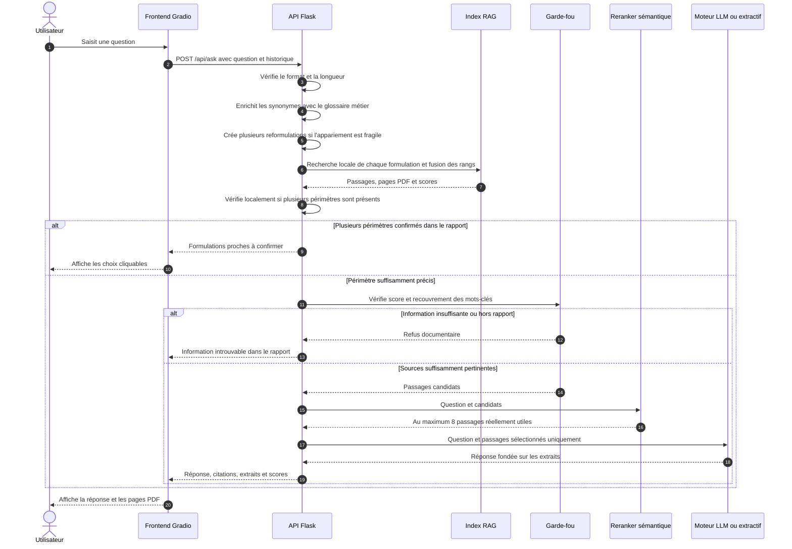
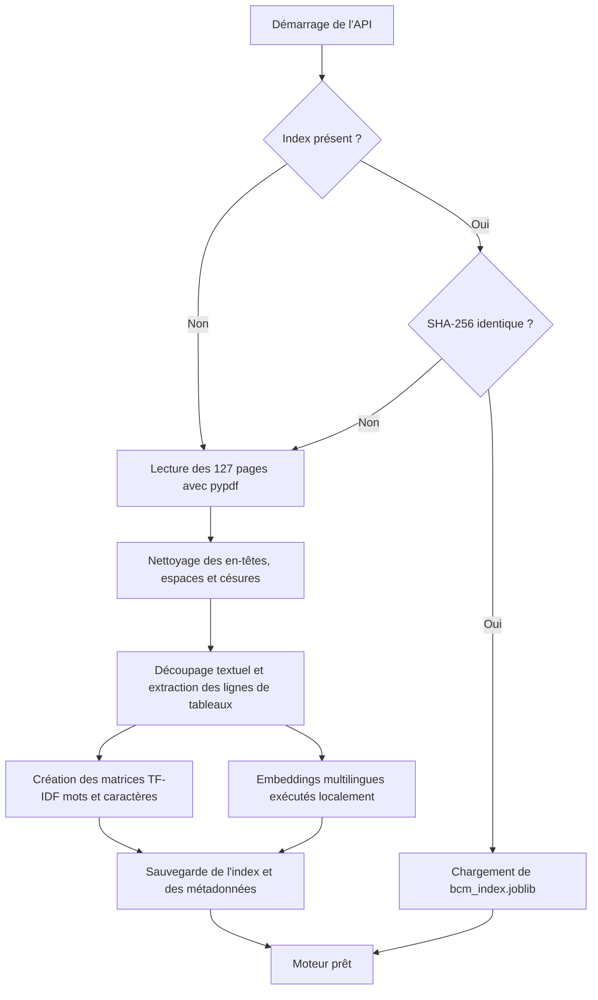
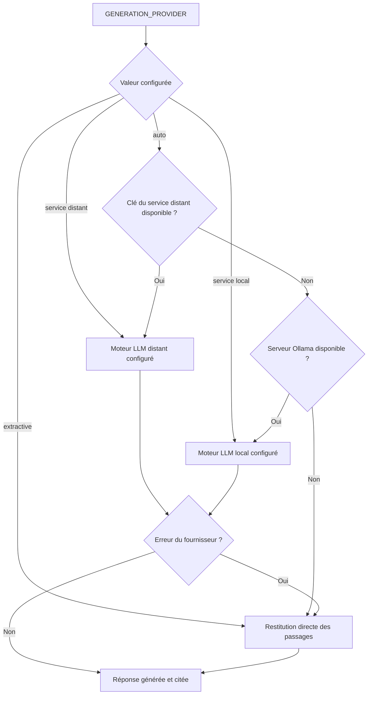

# Architecture du chatbot RAG BCM

Ce document décrit le fonctionnement du projet situé dans `Desktop/bcm_rag_chatbot`.

## Architecture générale

```mermaid
flowchart LR
    U["Utilisateur"]

    subgraph FRONT["Frontend Gradio - port 7861"]
        UI["Interface de conversation"]
        HIST["Historique récent"]
        DISPLAY["Réponse, pages PDF et scores"]
    end

    subgraph BACK["Backend Flask - port 5000"]
        HEALTH["GET /health"]
        ASK["POST /api/ask"]
        REINDEX["POST /api/reindex"]
        VALID["Validation de la requête"]
        GUARD["Contrôle de pertinence documentaire"]
    end

    subgraph RAG["Moteur RAG local"]
        CLEAN["Nettoyage du texte PDF"]
        CHUNK["Passages textuels et lignes de tableaux"]
        WORD["TF-IDF mots et bigrammes"]
        CHAR["TF-IDF caractères 3 à 5"]
        DENSE["Embeddings multilingues locaux - 384 dimensions"]
        EXPAND["Expansion déterministe du vocabulaire métier"]
        PLAN["Reformulations multiples si appariement fragile"]
        SEARCH["Recherche lexicale et sémantique"]
        RANK["Fusion des rangs : 45 % lexical + 55 % sémantique"]
        AMBIG["Validation locale des périmètres ambigus"]
        RERANK["Reranking sémantique : sélection des passages qui répondent réellement"]
    end

    subgraph DATA["Couche documentaire"]
        PDF["Rapport annuel 2025-BCM.pdf\n127 pages - source unique"]
        INDEX["rag_index.joblib\n2 413 passages et vecteurs locaux"]
        HASH["Empreinte SHA-256\ndétection des changements"]
    end

    subgraph GEN["Génération contrôlée"]
        ROUTER["Sélection du moteur de génération"]
        CLOUD["Service LLM distant\nconfiguré côté serveur"]
        LOCAL["Service LLM local\noptionnel"]
        EXTRACT["Mode extractif local\nmode de secours"]
        PROMPT["Instruction stricte : répondre uniquement avec les extraits"]
    end

    U --> UI
    UI --> HIST
    UI -->|"JSON HTTP"| ASK
    UI --> HEALTH
    ASK --> VALID
    VALID --> EXPAND
    EXPAND --> PLAN
    PLAN --> SEARCH
    INDEX --> WORD
    INDEX --> CHAR
    INDEX --> DENSE
    WORD --> SEARCH
    CHAR --> SEARCH
    DENSE --> SEARCH
    SEARCH --> RANK
    RANK --> AMBIG
    AMBIG -->|"Plusieurs périmètres"| SUGGEST["Formulations proches tirées du rapport"]
    SUGGEST --> UI
    AMBIG -->|"Périmètre précis"| GUARD
    GUARD -->|"Information absente"| REFUS["Réponse de refus"]
    GUARD -->|"Passages candidats"| RERANK
    RERANK -->|"Aucune preuve suffisante"| REFUS
    RERANK -->|"Passages réellement utiles"| ROUTER
    ROUTER --> CLOUD
    ROUTER --> LOCAL
    ROUTER --> EXTRACT
    PROMPT --> CLOUD
    PROMPT --> LOCAL
    CLOUD --> DISPLAY
    LOCAL --> DISPLAY
    EXTRACT --> DISPLAY
    REFUS --> DISPLAY
    DISPLAY --> U

    PDF --> CLEAN
    CLEAN --> CHUNK
    CHUNK --> WORD
    CHUNK --> CHAR
    CHUNK --> DENSE
    WORD --> INDEX
    CHAR --> INDEX
    PDF --> HASH
    HASH --> REINDEX
    REINDEX --> CLEAN
```



## Cycle de traitement d'une question



## Construction et actualisation de l'index



## Sélection du mode de réponse



## Organisation des fichiers

```text
bcm_rag_chatbot/
├── api/
│   ├── app.py              # Routes Flask et orchestration
│   ├── embeddings.py       # Embeddings multilingues locaux
│   ├── query.py            # Glossaire et expansion des requêtes
│   ├── rag.py              # Extraction, indexation et recherche
│   └── providers.py        # Moteurs de génération et mode extractif
├── core/
│   ├── config.py           # Configuration centralisée et validée
│   └── logging_config.py   # Journaux sûrs avec rotation
├── frontend/
│   └── app.py              # Interface Gradio
├── data/
│   └── Rapport annuel 2025-BCM.pdf
├── storage/
│   ├── bcm_index.joblib    # Index lexical et sémantique persistant
│   └── models/             # Poids du modèle local
├── evaluation/
│   ├── questions.jsonl     # Questions et pages attendues
│   └── results/            # Mesures avant et après
├── scripts/
│   ├── check_config.py     # Validation avant démarrage
│   ├── evaluate_retrieval.py # Benchmark Hit@K, MRR et refus
│   ├── index_embeddings.py # Construction des vecteurs locaux
│   └── index_report.py     # Reconstruction manuelle de l'index
├── tests/
│   ├── test_api.py
│   ├── test_config.py
│   └── test_rag.py
├── .env                    # Configuration locale et secrets
├── requirements.txt        # Dépendances d'exécution
├── requirements-dev.txt    # Dépendances de test
├── setup.sh                # Installation et indexation initiale
├── run.sh                  # Démarrage local de Flask et Gradio
├── run_api_prod.sh         # Démarrage WSGI de l'API
└── wsgi.py                 # Point d'entrée du serveur de production
```

## Principaux garde-fous

- Le PDF BCM est la seule source documentaire indexée.
- Une question sans passages suffisamment pertinents reçoit un refus explicite.
- Les pages de table des matières sont pénalisées pendant le classement.
- Les résultats sont diversifiés afin de limiter la répétition d'une même page.
- Une comparaison datée conserve la meilleure ligne de tableau lexicale parmi les candidats.
- Une question fragile peut produire jusqu'à quatre reformulations, toutes recherchées localement.
- Une suggestion n'est affichée que si son libellé est retrouvé dans les passages du rapport.
- Aucune réponse chiffrée n'est mémorisée pour traiter un cas particulier.
- Les fournisseurs génératifs ne reçoivent que la question, l'historique utile et les extraits récupérés.
- Les réponses affichent les pages PDF, les extraits et les scores de pertinence.
- La clé du service de génération reste dans le backend et n'est jamais transmise au navigateur.
- Chaque réponse porte un identifiant de requête pour corréler une erreur aux journaux.
- Les journaux n'enregistrent ni les questions, ni les réponses, ni les secrets.
- En production, la reconstruction de l'index exige un jeton d'administration.
- Les embeddings sont calculés localement : le rapport n'est pas envoyé à une API d'embeddings.
- Le seuil hybride a été calibré sur des questions présentes et absentes du rapport.

## Images exportées

Les diagrammes `architecture_complete` et `architecture_phase2` sont disponibles dans `docs/diagrammes/` aux formats Mermaid source (`.mmd`), SVG vectoriel (`.svg`) et PNG (`.png`). Le SVG est recommandé pour un document ou une présentation, car il reste net à toute taille.
- Une modification du PDF est détectée par son empreinte SHA-256 et déclenche la reconstruction de l'index.
