# Chatbot RAG — Documents BCM

Application de questions-réponses fondée **uniquement** sur les documents publiés par la Banque Centrale de Mauritanie qui sont indexés : le Rapport annuel de l’exercice 2025 (publié en 2026) et les Lettres d’information mensuelles 2026. Toute question sortant de ce corpus reçoit un refus explicite.



Documentation complémentaire :

- `PHASE_1_STABILISATION.md` détaille la configuration, les erreurs, les journaux, les profils et les tests ;
- `PHASE_2_QUALITE_RETRIEVAL.md` détaille le benchmark, la recherche hybride et les gains mesurés ;
- `PHASE_3_ANALYSE_GRAPHIQUES.md` détaille le rendu PDF, l’OCR local et la lecture des séries ;
- `ETAPES_CONSTRUCTION.md` explique la construction du chatbot en 16 étapes ;
- `ARCHITECTURE_MERMAID.md` contient les diagrammes Mermaid détaillés ;
- `docs/diagrammes/architecture_complete.mmd` est le diagramme source autonome ;
- `docs/diagrammes/architecture_phase2.mmd` détaille les reformulations et la clarification ;
- les deux diagrammes existent en SVG vectoriel et en PNG, prêts pour les documents et présentations.

- Frontend : widget web embarquable (`http://127.0.0.1:8090/demo.html`), servi par `./run.sh`
- Frontend interne : Gradio (`http://127.0.0.1:7861`), lancé à la demande par `python -m frontend.app`
- Backend : API Flask (`http://127.0.0.1:5000`)
- Recherche : TF-IDF mots + caractères, embeddings multilingues locaux, glossaire arabe-français et reformulations multiples fusionnées par rang
- Génération : OpenAI, Ollama, ou restitution extractive locale
- Précision : reranking OpenAI des passages candidats avant la rédaction
- Traçabilité : pages PDF, scores et extraits sources pour chaque réponse
- Garde-fou : refus explicite lorsque le rapport ne contient pas l’information
- Ambiguïté : suggestions cliquables tirées uniquement des libellés retrouvés dans le rapport
- Graphiques : sélection thématique de la page, rendu local, OCR Apple Vision et explication citée
- Conversation : résolution de « cette section », sélection d’un ancien sujet nommé et répétition fidèle
- Langues : choix direct **Français** ou **العربية**, conservé pendant la conversation et transmis à l’API

Résultat de la phase 2 sur 41 cas : `Hit@5` de 97,14 %, rappel des 12 candidats de 100 % et refus hors rapport de 100 %. Les 58 tests automatisés réussissent, dont les tests de la voie graphique locale, de la mémoire conversationnelle, du mode arabe, du choix explicite de langue, du rendu RTL des chiffres et de la résolution des numéros de tableaux. Ces chiffres sont des mesures techniques à compléter par une validation métier BCM.

## Questions en arabe

L’interface présente deux choix au début de la conversation : **Français** et **العربية**. Le choix est envoyé dans chaque requête et reste prioritaire, même si la question contient des mots, des normes ou des sigles dans l’autre langue :

```text
ما هو معدل نمو الناتج المحلي الإجمالي الحقيقي في عام 2025؟
لخص ما يقوله التقرير عن السيولة المصرفية.
```

Le backend utilise d’abord la langue choisie dans l’interface, enrichit localement la question arabe avec le vocabulaire français du rapport et interroge aussi l’index sémantique multilingue. Lorsque cette première recherche est probante, il passe directement à la génération : aucun appel séparé de traduction ou de reranking n’est effectué. La réponse est imposée en arabe standard moderne avec un effort de génération court. Cette voie réduit une question arabe courante à un seul appel distant au lieu de trois. Les anciens clients API qui omettent le champ `language` restent compatibles grâce à une détection de secours non visible dans l’interface.

Les chiffres, unités, années et citations `[p. PDF N]` restent exacts. En mode arabe, toute l’interface bascule en lecture droite-à-gauche : titre, état, zone de conversation, saisie, boutons, suggestions et exemples. Les années, nombres décimaux, pourcentages, milliers espacés comme `300 000`, normes et citations sont entourés d’isolats directionnels Unicode. Le navigateur les conserve ainsi à leur position logique au lieu de déplacer `2025` au début d’une ligne ou d’inverser les groupes d’un montant.

Le contrôle linguistique convertit notamment `milliards de MRU` et `مليار MRU` en unité arabe et tolère les seuls sigles ou normes techniques légitimes, par exemple `ISO 20022`, `RTGS`, `SWIFT` et `GIMTEL` : leur présence ne provoque plus le rejet d’une réponse arabe correcte. Les extraits bruts des sources, rédigés en français dans le PDF, sont masqués dans l’interface arabe afin d’éviter un affichage bilingue ; les pages et scores restent visibles. Les refus documentaires, demandes de clarification et intitulés de sources sont également affichés en arabe. L’historique peut mélanger le français et l’arabe ; si une répétition demande un changement de langue, la réponse est régénérée à partir des pages déjà citées au lieu d’être simplement recopiée.

Exemple couvert par un test de non-régression : `ما هي الإصلاحات التي يجري طرحها لأنظمة الدفع؟`. La recherche doit conserver les pages PDF 64 et 65, ne lancer ni planificateur ni reranker distant et produire une réponse arabe en un seul appel de génération.

Les demandes arabes portant sur un volume mensuel ou des transferts activent aussi la voie graphique locale. Par exemple, le graphique 76 est lu depuis la page PDF 65 et restitué avec les mois, le maximum et les principales hausses ou baisses entièrement en arabe, sans envoyer l’image ou ses coordonnées OCR à un service externe.

## Mémoire de la conversation

À chaque question, le client (widget ou Gradio) renvoie à Flask les huit derniers tours, soit au maximum 16 messages. Le backend peut ainsi :

- résoudre « cette section », « ce graphique », « ce sujet » ou « donne plus de détails » ;
- retrouver un échange plus ancien lorsqu’un thème est nommé, par exemple « répète ce que tu disais sur la liquidité » ;
- répéter exactement une ancienne réponse sans la régénérer ;
- réutiliser en priorité les pages déjà citées ;
- appliquer un OCR documentaire local lorsqu’une page citée est scannée et ne contient presque pas de texte extractible.

Cette mémoire est propre à la conversation affichée : elle n’est pas partagée entre utilisateurs. Le bouton **Nouvelle conversation** l’efface. Pour intégrer l’API dans le site de la BCM, le navigateur doit conserver le tableau `history` de la session et le renvoyer à chaque appel :

```json
{
  "question": "Résume cette section.",
  "history": [
    {"role": "user", "content": "Y a-t-il un rapport d’auditeur externe ?"},
    {"role": "assistant", "content": "Oui, à la page PDF 119."}
  ]
}
```

Les références comme « tableau 5, page 59 » sont résolues par le numéro du tableau. Le backend distingue la pagination imprimée du rapport de la pagination technique du PDF ; dans cet exemple, la page imprimée 59 correspond à la page PDF 30 citée par l’application.

## Expliquer un graphique

L’utilisateur peut demander par exemple :

```text
Explique le graphique 23 sur l’évolution de la liquidité bancaire.
Que montre le graphique sur l’évolution des dépôts, des crédits et de l’intermédiation ?
Explique le volume des virements par mois en 2025.
Y a-t-il un graphique sur les achats et ventes de devises euro ou dollar ?
Explique l'organigramme de la BCM.
Analyse l'état de la situation financière de la BCM.
Analyse l'état du résultat net et des autres éléments du résultat global.
Analyse l'état des variations des capitaux propres.
Analyse l'état des flux de trésorerie.
```

Le backend recherche d’abord les pages thématiquement proches, rend au maximum deux pages du PDF, cadre le visuel demandé puis extrait localement son titre, ses axes, ses années, sa légende et ses valeurs. Une formulation mensuelle comme « volume des virements par mois » active également cette voie, même sans le mot « graphique ». Pour un organigramme, il restitue séparément les instances de gouvernance, le Gouverneur et ses adjoints, les fonctions d’appui et les directions opérationnelles. Les quatre états financiers en image sont reconnus par leur titre : situation financière, résultat net et autres éléments du résultat global, variations des capitaux propres et flux de trésorerie. Chaque analyse compare les deux clôtures, calcule les variations pertinentes et distingue le constat comptable de son interprétation. L’explication cite systématiquement la page PDF.

Les images et le texte OCR restent sur la machine. Le premier traitement d’une page prend quelques secondes ; les demandes suivantes réutilisent le cache local `storage/chart_pages/`.

Pour une question d’existence, l’assistant commence par **Oui** ou **Non**. En cas de réponse positive, il fournit le numéro, le titre et la page PDF du graphique avant son explication.

Configuration facultative :

```dotenv
CHART_ANALYSIS_ENABLED=true
CHART_RENDER_DPI=170
CHART_MAX_PAGES=2
```

## Lettres d'information

Le corpus ne se limite plus au Rapport annuel : les **Lettres d'information
mensuelles de la BCM** (éditions 2026, janvier à juillet) sont indexées et
interrogeables au même titre.

```text
Que dit la lettre d'information de mars 2026 sur le don de sang ?
Quelles actions la BCM a-t-elle menées avec l'Université de Nouakchott ?
Quand la BCM a-t-elle lancé sa lettre d'information périodique ?
```

Ces lettres ne sont pas publiées en PDF : chaque édition est **une image**
attachée à une actualité du site. La chaîne comporte donc trois étapes, dont la
première ne s'exécute que sur un poste macOS :

```bash
python scripts/fetch_lettres_information.py    # image -> PDF paginé
python scripts/ocr_lettres_information.py      # OCR Apple Vision -> texte (macOS)
python scripts/index_report.py --force         # index lexical
python scripts/index_embeddings.py --force     # index sémantique
```

L'OCR produit des fichiers texte annexes versionnés dans
`data/lettres_information/ocr/`. **L'indexation et le service n'en dépendent
plus** : le serveur Linux de production lit ces fichiers et n'a besoin ni du
moteur OCR, ni des images, ni des PDF. C'est la même séparation qui permettra
plus tard d'indexer les pages du site sans exécuter de navigateur en production.

### Citations

Chaque source garde le repère qui a du sens pour le lecteur :

| Source | Repère cité | Affichage widget |
|---|---|---|
| Rapport annuel | `[p. PDF 39]` | badge `p. 39` |
| Lettre d'information | `[Lettre d'information Mars 2026, p. 2]` | badge cliquable vers bcm.mr |

Le repère du rapport annuel est **inchangé** : il figure déjà dans les réponses
servies, dans l'historique des conversations et dans les tests de
non-régression.

### Effet mesuré sur la recherche

Le TF-IDF est global au corpus : ajouter 180 passages redistribue légèrement les
scores des passages existants. Sur les 41 cas d'évaluation, le résultat est
**strictement inchangé** — `Hit@5` 97,14 %, rappel@12 100 %, refus hors corpus
100 %, MRR 0,7807. Deux réglages ont été élargis pour absorber ce reclassement
sans perdre de page : `RETRIEVAL_CANDIDATES` (12 → 18) et la tranche de preuves
transmise pour une question large (8 → 10 passages).

## Réponse diffusée au fil de l'eau

`POST /api/ask/stream` renvoie la réponse en Server-Sent Events. Le temps total
est inchangé — la recherche, la planification et la sélection restent des
préalables — mais l'utilisateur n'attend plus devant un écran figé :

```text
0,04 s  event: stage  {"stage": "recherche"}
0,62 s  event: stage  {"stage": "reformulation"}
5,13 s  event: stage  {"stage": "selection"}
6,72 s  event: stage  {"stage": "redaction"}
7,49 s  event: delta  {"text": "L’inflation"}   ← premier mot affiché
12,16 s event: done   {"answer": …, "sources": […], "grounded": true}
```

**Le texte diffusé est provisoire.** Les contrôles de citation, le repli
extractif et le rendu bidirectionnel arabe exigent la réponse entière : seul
l'événement `done` a passé ces contrôles, et le client doit remplacer par sa
valeur ce qu'il a affiché. En arabe, les fragments arrivent sans isolats
directionnels ; la réponse finale les porte.

Les deux points d'entrée partagent exactement le même pipeline : `/api/ask`
attend l'événement final et renvoie un JSON unique, `/api/ask/stream` retransmet
les événements. Sans ce partage, la voie diffusée aurait sa propre copie de la
chaîne et les deux divergeraient à la première correction.

Derrière un proxy, l'en-tête `X-Accel-Buffering: no` est indispensable : nginx
tamponne sinon la réponse et annule tout le bénéfice.

## Temps de réponse

Le temps est dominé par les appels distants successifs, pas par la recherche
locale, qui coûte moins d'un dixième de seconde. Profil mesuré sur une question
large : génération 5,9 s, planification 2,9 s, reranking 2,8 s, recherche 0,5 s.

Trois réglages tiennent compte du fait que les tokens de raisonnement sont
décomptés du plafond de sortie. Un plafond serré ne réduit pas la facture —
seuls les tokens produits sont payés — mais tronque la réponse ou vide la
sortie :

```dotenv
OPENAI_MAX_OUTPUT_TOKENS=3000
GEMINI_MAX_OUTPUT_TOKENS=8000
GEMINI_THINKING_LEVEL=low
```

Le modèle d'embedding est préchargé à la création de l'application. Sans cela,
son chargement (environ six secondes) était payé par la première question de
chaque worker `gunicorn`, `/health` ne réchauffant que celui qui répond à la
sonde.

Les deux appels JSON — planification et reranking — imposent un schéma de
sortie. Le modèle produisait sinon un JSON invalide environ une fois sur deux
(crochet fermant manquant), ce qui perdait l'appel, son délai et son coût.

## Déploiement

L'API est hébergée sur Railway, le widget sur Vercel, et le site de la BCM ne
porte qu'une balise `<script>` :

```
Site bcm.mr  ──<script src=…>──►  Vercel   (widget statique)
     │
     └──────── appels XHR ───────►  Railway  (API Flask + index RAG)
```

- `docs/DEPLOIEMENT_RAILWAY_VERCEL.md` — mise en service et exploitation ;
- `docs/INTEGRATION_EQUIPE_BCM.md` — intégration côté site, à transmettre à
  l'équipe de développement de la BCM ;
- `railway.json`, `vercel.json`, `.env.railway.example` — configuration.

L'index est construit **pendant la construction de l'image** et vérifié : le
conteneur démarre avec son corpus, sans volume persistant. Mettre à jour le
corpus revient à redéployer.

## Démarrage rapide

Dans le Terminal :

```bash
cd "$HOME/Desktop/bcm_rag_chatbot"
./setup.sh
./run.sh
```

`./run.sh` démarre l’API Flask puis sert le widget sur `http://127.0.0.1:8090/demo.html`,
qui s’ouvre automatiquement. Pour arrêter les deux services, utilisez `Ctrl+C` dans le Terminal.

Avant de démarrer, le script vérifie que l’origine du widget figure bien dans
`CORS_ALLOWED_ORIGINS`. Sans ce contrôle, le navigateur bloquerait chaque appel
sans laisser la moindre trace dans les journaux de l’API : le widget resterait
muet et la panne serait invisible. Les ports se règlent par `WIDGET_HOST` et
`WIDGET_PORT`.

L’interface Gradio reste disponible pour une démonstration interne :

```bash
.venv/bin/python -m frontend.app
```

## Modes de génération

Le fichier `.env` contrôle le mode :

```dotenv
GENERATION_PROVIDER=auto
```

En mode `auto`, l’application choisit dans cet ordre :

1. OpenAI si `OPENAI_API_KEY` est définie ;
2. Ollama si son serveur local répond ;
3. mode `extractive`, qui affiche directement les meilleurs passages du rapport.

### OpenAI

Ajoutez la clé dans `.env` :

```dotenv
GENERATION_PROVIDER=openai
OPENAI_API_KEY=sk-...
OPENAI_MODEL=gpt-5.6-terra
OPENAI_RERANK_MODEL=gpt-5.6-luna
OPENAI_REASONING_EFFORT=medium
```

La clé reste côté backend Flask et n’est jamais envoyée au navigateur.

### Ollama local

Après avoir installé Ollama et téléchargé un modèle :

```bash
ollama pull llama3.2:3b
```

Configurez `.env` :

```dotenv
GENERATION_PROVIDER=ollama
OLLAMA_MODEL=llama3.2:3b
```

## API Flask

État de l’index :

```bash
curl http://127.0.0.1:5000/health
```

Question :

```bash
curl -X POST http://127.0.0.1:5000/api/ask \
  -H 'Content-Type: application/json' \
  -d '{"question":"Quel a été le taux de croissance du PIB réel en 2025 ?","language":"fr"}'
```

Reconstruire l’index après remplacement du PDF :

```bash
curl -X POST http://127.0.0.1:5000/api/reindex
```

## Remplacer le rapport

Placez le nouveau fichier sous le nom exact :

`data/Rapport annuel 2025-BCM.pdf`

Puis relancez l’application. L’empreinte SHA-256 du PDF est vérifiée ; l’index est automatiquement reconstruit si le contenu a changé.

## Tests

```bash
APP_ENV=test GENERATION_PROVIDER=extractive .venv/bin/python -m pytest -q
```

Les tests n'appellent aucun service externe et ne consomment pas la clé API locale.

## Évaluation du retrieval

```bash
.venv/bin/python scripts/evaluate_retrieval.py \
  --mode hybrid \
  --output evaluation/results/hybrid_v6.json
```

Le modèle sémantique est exécuté localement. Le rapport n'est pas envoyé à un service d'embeddings externe.

## Profils d'exécution

- `APP_ENV=development` : Flask et le widget via `./run.sh` ;
- `APP_ENV=test` : tests isolés, journaux fichier désactivés et génération extractive ;
- `APP_ENV=production` : API WSGI via `./run_api_prod.sh`.

La configuration complète et les contrôles associés sont expliqués dans `PHASE_1_STABILISATION.md`.

## Structure

```text
api/          API Flask, récupération et fournisseurs de génération
core/         configuration centralisée et journaux
frontend/     interface Gradio (démo interne, non lancée par ./run.sh)
widget/       widget web embarquable servi par ./run.sh
data/         rapport source unique
storage/      index persistant
evaluation/   questions de référence et rapports de métriques
scripts/      construction manuelle de l’index
tests/        tests de récupération et d’API
```

## Limite documentaire

Le fichier trouvé dans Téléchargements est intitulé « Rapport annuel 2025-BCM.pdf ». Ses métadonnées indiquent une création le 31 juillet 2026. L’application le décrit donc comme le rapport de l’exercice 2025 publié en 2026, sans le renommer artificiellement en « rapport 2026 ».
