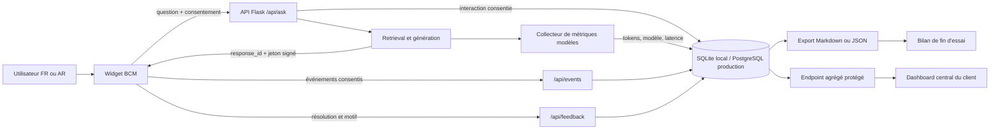

# Analytics du pilote — Assistant des publications de la BCM

Ce guide décrit la collecte, l'exploitation locale, la production Railway et
la construction du bilan client après la période d'essai.

## 1. Objectif et périmètre

L'analytics doit répondre à cinq questions :

1. combien de sessions consenties et de questions ont été observées ;
2. quelles publications et quels sujets intéressent le plus les utilisateurs ;
3. quelles réponses sont utiles, refusées, ambiguës ou jugées insuffisantes ;
4. quelles sont la latence, les erreurs et la consommation de tokens ;
5. quelles améliorations prioriser avant une généralisation.

Les chiffres d'audience portent uniquement sur les sessions ayant accepté la
mesure. Il faut toujours les présenter comme **sessions consenties**, jamais
comme visiteurs uniques de `bcm.mr`.

## 2. Flux de données



## 3. Données enregistrées

### `logged_questions`

Une ligne par réponse consentie : identifiants opaques, langue, question,
réponse, thème local, statut du pipeline, sources, score maximal, latence,
tokens agrégés, fournisseur/modèle et repli éventuel.

Statuts possibles :

- `answered` : réponse sourcée ;
- `answered_degraded` : réponse obtenue après un échec de génération ;
- `clarification` : l'assistant a proposé des formulations ;
- `refused` : information absente ou insuffisamment établie ;
- `generation_error` : preuves trouvées mais génération impossible ;
- `session_limit` ou `request_error` : erreur de parcours.

### `model_calls`

Une ligne par opération distante : `query_planning`, `reranking` ou
`generation`. Elle conserve le fournisseur, le modèle, la latence, le succès
et les compteurs de tokens fournis par le SDK : entrée, entrée mise en cache,
sortie, raisonnement et total.

Un compteur nul signifie que le fournisseur ou sa version de SDK n'a pas
retourné cette métrique. Il ne faut pas le présenter comme une consommation
réellement nulle sans vérifier les données du fournisseur.

### `answer_feedback`

Le retour est lié au `response_id` par un jeton HMAC signé côté serveur. Une
session ne peut voter qu'une fois sur la même réponse. Les champs importants
sont : `rating`, `resolved` et `reason` (`incorrect`, `incomplete`,
`missing_source`, `unclear`, `too_slow` ou `other`).

### `ui_events`

Événements de parcours : ouverture, question, suggestion, réception de la
réponse, ouverture des sources, clic vers une publication, feedback et limite
de session. Aucun texte de question n'est placé dans cette table.

## 4. Confidentialité

- Le texte n'est conservé qu'après acceptation du popup.
- Le refus du consentement n'empêche pas l'utilisation de l'assistant.
- Un clic de feedback vaut accord ponctuel pour cette réponse.
- Le `session_id` aléatoire est pseudonymisé par HMAC avant stockage.
- Aucune adresse IP, aucun nom et aucun courriel ne sont collectés.
- `ANALYTICS_HASH_SALT` ne doit jamais être commité.
- L'export standard est agrégé. `--include-content` doit rester réservé aux
  analystes habilités.
- Fixer avec le responsable métier une conservation, par exemple 90 jours,
  puis automatiser la purge conformément à la politique BCM applicable.

## 5. Développement local — SQLite

Dans `.env` :

```dotenv
APP_ENV=development
DATABASE_URL=
ANALYTICS_HASH_SALT=une-valeur-locale-longue-et-aleatoire
ANALYTICS_ADMIN_TOKEN=un-jeton-local-pour-le-dashboard
```

La base est créée dans `storage/analytics.db`. Le schéma est migré au démarrage
de Flask sans effacer les anciennes lignes.

Le widget demande le consentement avant la première question. L'interface
Gradio interne propose une case facultative équivalente et transmet un
identifiant de session aléatoire à Flask ; si elle reste décochée, la
conversation Gradio n'est pas journalisée.

Inspection rapide :

```bash
cd "$HOME/Desktop/bcm_rag_chatbot"
sqlite3 storage/analytics.db ".tables"
sqlite3 -header -column storage/analytics.db \
  "SELECT language, topic, status, count(*) AS total FROM logged_questions GROUP BY 1,2,3 ORDER BY total DESC;"
```

Générer un bilan de 30 jours :

```bash
.venv/bin/python scripts/analytics_report.py --days 30 \
  --output storage/bilan_pilote.md
```

Exporter pour un autre dashboard :

```bash
.venv/bin/python scripts/analytics_report.py --days 30 --format json \
  --output storage/bilan_pilote.json
```

Inclure les questions problématiques consenties uniquement pour une revue
interne :

```bash
.venv/bin/python scripts/analytics_report.py --days 30 --include-content \
  --output storage/revue_qualite_interne.md
```

## 6. Production — Railway et PostgreSQL

SQLite n'est pas une base analytique de production : sans volume persistant,
son fichier disparaît lors d'un redéploiement. Ajouter PostgreSQL au projet
Railway et vérifier que le service API reçoit `DATABASE_URL`.

Variables minimales du service API :

```dotenv
APP_ENV=production
DATABASE_URL=${{Postgres.DATABASE_URL}}
ANALYTICS_HASH_SALT=<secret long généré une seule fois>
ANALYTICS_ADMIN_TOKEN=<secret distinct réservé au dashboard>
```

Ne pas changer `ANALYTICS_HASH_SALT` pendant le pilote : les mêmes sessions
seraient pseudonymisées différemment et les statistiques de parcours seraient
fragmentées.

Au déploiement :

1. `scripts/check_config.py` refuse PostgreSQL en production sans sel HMAC ;
2. Flask crée ou migre les quatre tables ;
3. une panne analytics est journalisée mais ne bloque pas les réponses ;
4. vérifier les logs `analytics_schema_failed`, `analytics_log_failed` et
   `analytics_event_failed` ;
5. contrôler que de nouvelles lignes apparaissent après une question de test
   consentie.

Depuis un shell du service Railway :

```bash
python scripts/analytics_report.py --days 30 --format json
```

Pour une extraction régulière, exécuter le script dans un job Railway planifié
ou laisser l'outil de supervision appeler l'endpoint agrégé. Ne jamais exposer
directement PostgreSQL au navigateur.

## 7. Connexion à une application centrale

Deux intégrations sont possibles :

### Lecture directe de PostgreSQL

Appropriée pour Power BI, Metabase, Grafana ou une plateforme data interne.
Utiliser un utilisateur **lecture seule**, limiter son accès aux tables
analytics et conserver les identifiants de base côté serveur.

### Endpoint agrégé

```http
GET /api/admin/analytics?days=30
Authorization: Bearer <ANALYTICS_ADMIN_TOKEN>
```

Il retourne uniquement des agrégats JSON : aucune question ni réponse. C'est
la voie recommandée lorsque l'application centrale ne doit pas accéder à la
base brute.

Exemple :

```bash
curl -H "Authorization: Bearer $ANALYTICS_ADMIN_TOKEN" \
  "https://<api-railway>/api/admin/analytics?days=30"
```

## 8. KPI et règles de lecture

```text
Satisfaction = votes positifs / votes exprimés
Couverture du feedback = réponses évaluées / interactions consenties
Résolution = retours resolved=true / retours ayant répondu à la question
Réponses sourcées = grounded=true / interactions
Refus = status=refused / interactions
Questions par session = interactions / sessions consenties
Tokens par interaction = total_tokens / interactions
```

Toujours afficher le numérateur et le dénominateur. Un taux de satisfaction de
100 % sur deux votes ne constitue pas une conclusion robuste.

Le coût monétaire n'est pas figé dans le code : les prix changent et diffèrent
selon le fournisseur, le modèle, le cache et parfois le type de token. Le
dashboard central doit joindre `model_calls` à une table tarifaire datée. On
peut alors calculer :

```text
coût de l'appel =
  tokens_entrée_non_cachés × prix_entrée
  + tokens_entrée_cachés × prix_cache
  + tokens_sortie × prix_sortie

coût par réponse utile = coût total / réponses résolues
```

## 9. Structure du bilan client

1. périmètre, dates, documents et modèle déployé ;
2. adoption : sessions consenties, questions et évolution quotidienne ;
3. usages : langues, thèmes, publications et sources dominantes ;
4. qualité : satisfaction, résolution, refus, clarifications et motifs ;
5. performance : latence p50/p95, erreurs et replis ;
6. consommation : tokens totaux et par réponse utile ;
7. lacunes documentaires et questions prioritaires ;
8. recommandations classées par impact et effort ;
9. décision proposée : généralisation, prolongation ou corrections préalables.

## 10. Vérifications avant le début de l'essai

- `DATABASE_URL` pointe bien vers PostgreSQL sur Railway.
- Le sel et le jeton d'administration sont définis et différents.
- Une question consentie crée une ligne dans `logged_questions`.
- La génération crée une ligne dans `model_calls` avec le bon modèle.
- Un pouce positif et un pouce négatif avec motif sont enregistrés.
- Un second vote sur la même réponse est ignoré.
- L'endpoint agrégé refuse une requête sans jeton.
- Les statistiques FR et AR sont séparées.
- La durée de conservation et les personnes habilitées sont validées.
